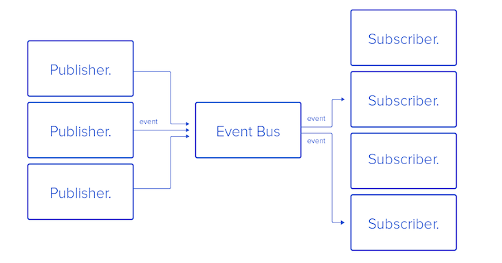

### Subscription

`TypeGraphQL`을 통해 `Subscription` 사용하는 방법을 연습합니다.

---

### What is Subscription?

`Subscription`이란 `WebSocket`을 통해 클라이언트와의 연결을 유지하면서 실시간으로 `Push Event`를 발생시키는 기술입니다.

<br/>

각 `Subscriber`은 하나 이상의 관심사(`Topic`)를 설정할 수 있으며, `Publisher`가 임의의 `Topic`으로 이벤트를 발생시키면, 실시간으로 해당 토픽을 관찰하던 모든 클라이언트에게 데이터가 전달됩니다. 보통 `Mutation`에서 이벤트를 발생시키도록 설계됩니다.



---

### Simple Subscription

매우 간단한 카운터 구독모델을 생각해보겠습니다. `Mutation`을 통해 카운터를 증감시키고 짝수가 될 때 마다 `"even"` 토픽으로 이벤트를 발생시킵니다. 물론 `Subscription`으로 이 이벤트를 캐치하겠습니다.

<br/>

`Chatper 04`에서 이어서 시작하겠습니다. `@PubSub()`를 통해 `PubSubEngine`을 불러오고, 짝수인 경우에는 `pubsub.publish()`를 통해 이벤트를 발생시키겠습니다.

```ts
import { PubSub, PubSubEngine, ... } from "type-graphql";

@Resolver()
export class CounterResolver {
    private cnt: number = 0;

    @Mutation(() => Int)
    async count(
        @Arg("command", () => CounterCommand) command: CounterCommand,
        @PubSub() pubsub: PubSubEngine
    ) {
        switch (command) {
            case CounterCommand.UP: {
                this.cnt++;
                break;
            }
            case CounterCommand.DOWN: {
                this.cnt--;
                break;
            }
            default: {
                throw new Error(`Unknown command : ${command}`);
            }
        }

        //
        // 카운터가 2의 배수가 된다면 "even" 이벤트를 배포.
        // 데이터(cnt)도 함께 넘긴다.
        if (this.cnt % 2 === 0) {
            const topic: string = "even";
            await pubsub.publish(topic, this.cnt);
        }
        return this.cnt;
    }
}
```

<br/>

이제 `"even"` 토픽을 관찰하는 `Subscription`을 만들 차례입니다. 토픽을 등록하려면 `{ topic: ... }` 옵션을 넘기면 됩니다. 3가지 스타일에서 편한 것을 선택해주세요. `@Root` 데코레이터는 `Publisher`가 전송한 데이터(`this.cnt`)를 `Injection`하기 위해 사용됩니다.

```ts
@Resolver()
class CounterResolver {
    ...

    @Subscription(() => Int, {
        topics: "even", // single-topic
        topics: ["even"], // mutiple-topics
        topics: (info) => ["even"], // dynamic-topics,
    })
    subscribeEven(@Root() cnt: number): number {
        return cnt;
    }
}
```

위의 코드의 결과로 다음 스키마가 생성됩니다.

```ddl
type Subscription {
    subscribeEven : Int!
}
```

아래 쿼리로 구독을 시작하면, 이제 카운터가 짝수가 될 때 마다 이를 감지할 수 있습니다.

```graphql
subscription {
    subscribeEven
}
```

---

### Filter

`{ filter : (info)=>boolean }`을 명시적으로 넘기면 특정 조건을 만족하는 이벤트만 통과시킬 수 있습니다. 위의 카운터에서 4의 배수는 차단하려면 다음과 같이 적으면 됩니다.

```ts
@Resolver()
class CounterResolver {
    ...

    @Subscription(() => Int, {
        topics: "even",
        filter: ({ payload }) => {
            const enabled = payload % 4 !== 0;
            return enabled;
        },
    })
    subscribeEven(@Root() cnt: number): number {
        return cnt;
    }
}
```

---

### Dynamic Topics

`Subscription`의 토픽은 `Connection`이 수립되는 시점에서 설정되기 때문에 `Dynamic`하게 관심사를 설정할 수 있습니다. 예를 들어서 관심사를 `채팅방의 번호`로 설계하면, 특정 채팅방을 구독하고 있는 클라이언트에게만 이벤트를 전달할 수 있습니다.

```ts
@InputType()
class EnterChatRoomInput {
    @Field(() => Int)
    chatRoomNumber!: number;
}

@Resolver()
export class MessageResolver {
    @Subscription(() => Message, {
        topics: ({ args, context, info }) => {
            //
            // 채팅방 번호를 토픽으로 지정한다.
            return String(input.chatRoomNumber);
        },
        filter: ({ args, context, info, payload }) => {
            //
            // 문자열의 길이가 홀수라면 구독자에게 알림이 전송되지 않음.
            const contents: string = payload.contents;
            const enabeld: boolean = contents.length % 2 === 0;
            return enabeld;
        },
    })
    enterChatRoom(
        @Root() message: Message,
        @Arg("input", () => EnterChatRoomInput) input: EnterChatRoomInput
    ): Message {
        return message;
    }

    @Mutation(() => Message)
    async newMessage(
        @Arg("input", () => Message)
        message: Message,
        @PubSub() pubsub: PubSubEngine
    ) {
        //
        // 채팅방 번호로 이벤트를 발생시킨다.
        await pubsub.publish(message.chatRoomNumber, message);
        return message;
    }
}
```
