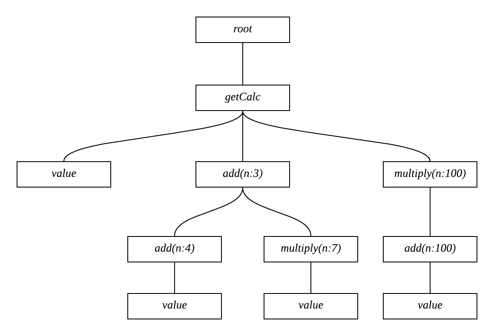
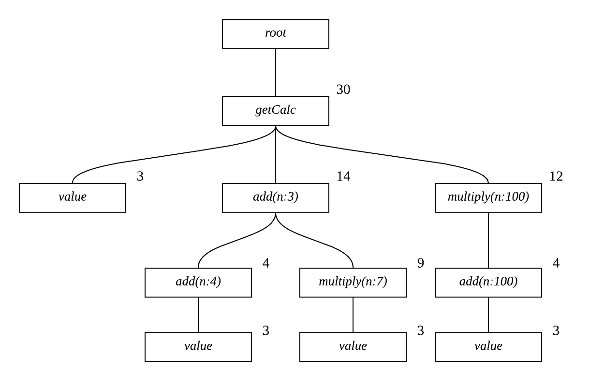
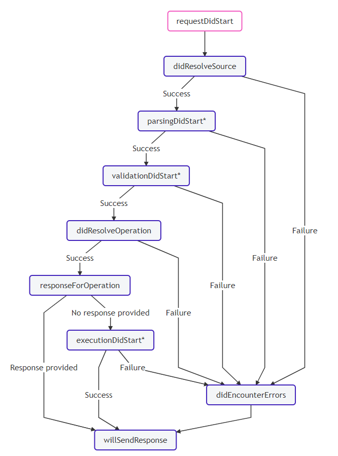

### Complexity and Apollo Plugin

단일 쿼리라도 수천개의 데이터베이스 연산이 포함되었다면 이것은 `DDoS` 공격으로 이어질 수 있고, 서버에 엄청난 부담을 가할 수 있습니다. 이러한 문제를 해결하기 위해 `TypeGraphQL`은 [`graphql-query-complexity`](https://github.com/ivome/graphql-query-complexity)와 같은 복잡도 분석기를 내장할 수 있는 옵션을 제공합니다.

<br/>

클라이언트가 쿼리를 요청하면 먼저 `Complexity`를 분석한 뒤, 비용이 너무 크다 싶으면 요청을 거절할 수 있습니다.

---

### Query Tree

`Query`, `Mutation`, `Subscription`는 잘 살펴보면 `Tree`의 형태를 띄고 있는 것을 볼 수 있습니다. 예를 들어 아래의 누산기 쿼리는 다음과 같이 트리 형태로 표현될 수 있습니다.

```graphql
query {
    getCalc {
        value # default is 0
        add(n: 3) {
            add(n: 4) {
                value # will return 7
            }
            multiply(n: 7) {
                value # will return 21
            }
        }
        multiply(n: 100) {
            add(n: 100) {
                value # will return 100
            }
        }
    }
}
```



---

### Complexity

##### 비용 설정

이제 각 필드에 `Complexity`을 할당하고, 쿼리의 총 비용을 계산해보겠습니다. 필드의 비용은 `number` 또는 `({ args, childComplexity, field, type }) => number` 형태로 지정할 수 있습니다.

```ts
@ObjectType()
class Calc {
    @Field(() => Int, {
        //
        // 상수형 고정 비용
        complexity: 1,
    })
    value: number = 0;

    @Field(() => Calc, {
        //
        // 함수형 가변 비용
        // 자식 노드들의 비용 총합에서 1을 더한다.
        complexity: ({ childComplexity }) => childComplexity + 1,
    })
    add(@Arg("n", () => Int) n: number): Calc {
        this.value += n;
        return this;
    }

    @Field(() => Calc, {
        //
        // 함수형 가변 비용
        // 자식 노드들의 비용 총합에서 3을 곱한다.
        complexity: ({ childComplexity }) => childComplexity * 3,
    })
    multiply(@Arg("n", () => Int) n: number): Calc {
        this.value *= n;
        return this;
    }
}
```

`complexity`의 기본값은 `1`이며, 다음 노드에도 비용을 할당할 수 있습니다.

-   `@Field`
-   `@FieldResolver`
-   `@Mutation`
-   `@Subscription`

<br/>

##### 비용 측정

`graphql-query-complexity`는 3개의 비용 측정기(`estimator`)를 제공합니다.

-   `simpleEstimator` : 상수형 비용만 계산할 수 있습니다. 비용이 정의되지 않았다면 `1` 또는 `given default value`로 계산합니다. 함수형 비용이 정의되었다면 `NaN`이 반환됩니다.
-   `fieldExtensionsEstimator` : 함수형 비용을 계산할 수 있습니다. 필드에 정의된 `extensions`의 `complexity`프로퍼티를 읽습니다. 비용이 정의되지 않은 노드는 무시합니다.
-   `directiveEstimator` : `complexity` 지시자를 사용한 상수형 또는 곱셈형(`상수` \* `가중치1` \* `가중치2` \* ...) 비용을 계산할 수 있습니다.

<br/>

여러개의 비용 측정기를 함께 사용할 수 있으며, 보편적으로 `simpleEstimator`와 `fieldExtensionsEstimator`의 조합을 사용합니다.

<br/>

##### 비용 계산

보편적인 측정기 조합(`simpleEstimator` + `fieldExtensionsEstimator`)을 사용하여 위에서 나온 `Query Tree`의 비용을 계산하면 다음과 같습니다.



-   `value`는 상수형 비용 `3`을 갖습니다. 함수형 비용 `자식 노드들의 총합 + 3`과 같습니다.
-   `add`는 함수형 비용 `자식 노드들의 총합 + 1`을 갖습니다.
-   `multiply`는 함수형 비용 `자식 노드들의 총합 * 3`을 갖습니다.
-   `getCalc`는 기본값인 상수형 비용 `1`을 갖습니다. 함수형 비용 `자식 노드들의 총합 + 1`과 같습니다.

<br/>

##### 비용 제한

`Apollo Plugin`을 사용하여 `추상 문법 트리(AST)`가 완성된 뒤에 `graphql-query-complexity`을 호출할 수 있습니다. `requestDidStart`는 클라이언트에게 쿼리가 들어왔을 때 발생하고, `didResolveOperation`은 쿼리를 `AST`로 만들었을 때 호출됩니다. 이에 대한 자세한 내용은 다음 절에서 설명합니다.

```ts
export const server = new ApolloServer({
    schema,
    plugins: [
        {
            requestDidStart: () => ({
                didResolveOperation({ request, document }) {
                    const complexity = getComplexity({
                        schema,
                        operationName: request.operationName,
                        query: document,
                        variables: request.variables,
                        estimators: [
                            fieldExtensionsEstimator(),
                            simpleEstimator({ defaultComplexity: 1 }),
                        ],
                    });

                    //
                    // 비용을 출력한다.
                    console.log(`Used Complexity : ${complexity}`);

                    //
                    // 예산을 초과했는지 검사한다.
                    const budget = 30;
                    if (budget < complexity) {
                        throw new Error(
                            `비용이 ${budget}보다 큰 쿼리는 허용되지 않습니다.`
                        );
                    }
                },
            }),
        },
    ],
});
```

---

### Apollo Plugin

`Apollo Server`가 발생시킨 `Life-Cycle` 이벤트를 감지하여 사용자 정의 함수를 실행하는 기능입니다. `서버`의 생명주기와 `파서`의 생명주기로 구성됩니다.

<br/>

#### 서버 생명주기 이벤트

##### `serverWillStart`

서버가 실행되려는 시점에 발생합니다. 아래와 같이 서버가 시작되는 것을 알릴 수 있습니다. `async` 함수도 허용되지만 `resolve`될 때 까지 서버는 실행되지 않습니다. 여기서 에러가 발생한다면 서버는 종료됩니다.

```ts
const server = new ApolloServer({
    plugins: [
        {
            serverWillStart() {
                console.log("Server starting!");
            },
        },
    ],
});
```

<br/>

##### `requestDidStart`

서버가 사용자의 요청을 받았을 때(= `응답을 준비하려고 할 때`) 발생합니다. `serverWillStart`와 달리 `async`를 허용하지 않습니다.

```ts
const server = new ApolloServer({
    plugins: [
        {
            requestDidStart() {
                console.log("Request did start.");
            },
        },
    ],
});
```

이 함수는 `파서 생명주기 이벤트`를 포함하는 객체를 반환할 수 있습니다. 위에서 살펴봤던 `didResolveOperation`이 파서 생명주기 이벤트 중 하나입니다.

```ts
export const server = new ApolloServer({
    schema,
    plugins: [
        {
            requestDidStart: () => ({
                didResolveOperation({ request, document }) {
                    ...
                },
            }),
        },
    ],
});
```

<br/>

#### 파서 생명주기 이벤트 (요청-응답 이벤트)

##### Work Flow

다음 순서대로 이벤트가 발생합니다. 자세한 설명은 다음 절부터 시작합니다.

-   `requestDidStart`
-   `didResolveSource`
-   `parsingDidStart`
-   `validationDidStart`
-   `didResolveOperation`
-   `responseForOperation`
-   `executionDidStart`
-   `DidEncounterErrors`
-   `willSendResponse`

<br/>

모형도는 다음과 같습니다.

<div style="text-align:center"></div>

<br/>

##### End Hooks

위의 모형도 중에 별표 표시가 되어있는 것이 `End Hooks`이며 `~didStart`로 끝납니다. 이 이벤트들은 무언가 동작이 완료되었을 때 발생되는데, 이 동작에 에러가 없었는지 판별하기 위해 `error`를 인자로 받을 수 있습니다.

```ts
const myPlugin = {
    requestDidStart() {
        return {
            parsingDidStart() {
                return (err) => {
                    if (err) {
                        console.error(err);
                    }
                };
            },
            validationDidStart() {
                // This end hook is unique in that it can receive an array of errors,
                // which will contain every validation error that occurred.
                return (errs) => {
                    if (errs) {
                        errs.forEach((err) => console.error(err));
                    }
                };
            },
            executionDidStart() {
                return (err) => {
                    if (err) {
                        console.error(err);
                    }
                };
            },
        };
    },
};
```

<br/>

##### `didResolveSource`

클라이언트에게 `문자열 쿼리`를 얻었을 때 호출되며, `Automated Persisted Queries`처럼 서버측 캐시에서 쿼리를 얻어오는 상황에서는 호출되지 않습니다.

<br/>

##### `parsingDidStart`

이 이벤트는 쿼리를 `Document AST`로 파싱하려고 할 때 호출됩니다. 다만 서버측 캐시에 이전에 만들어두었던 `Document AST`가 있다면 이 이벤트는 발생하지 않습니다. 쿼리를 다시 파싱하지 않기 때문이죠.

<br/>

##### `validationDidStart`

위에서 만들어진 `AST`가 `schema`와 일치하는지 검사합니다. 이 이벤트도 `parsingDidStart`처럼 서버측 캐시에 이전 결과가 남아있다면 호출되지 않습니다. 이 단계부터 `Document AST`를 사용할 수 있습니다.

<br/>

##### `didResolveOperation`

이 이벤트는 `Document AST`를 어떻게 수행해야 할지 결정되었을 때 발생됩니다. 이 단계부터 `operationName`과 `Operation AST`를 사용할 수 있습니다. `Complexity Estimator`가 `operationName`를 요구하기 때문에, 이 단계에서 비용검사를 진행한 것입니다.

<br/>

##### `responseForOperation`

쿼리가 실행되기 `바로 직전`에 호출됩니다.

<br/>

##### `executionDidStart`

쿼리가 실행되고 `바로 직후`에 호출됩니다.

<br/>

##### `didEncounterErrors`

`parsing`, `validating` 또는 `executing` 도중에 에러가 발생되었을 때 호출됩니다.

<br/>

##### `willSendResponse`

사용자에게 응답을 보내기 전에 호출됩니다.
