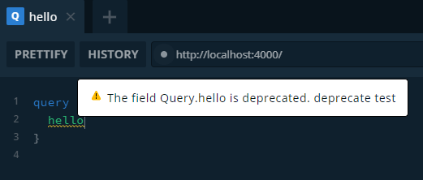

### Directives

`GraphQL`의 지시어는 `@`로 시작하고 부가적인 기능을 제공한다는 점에서 타입스크립트의 `Decorator`와 비슷한 것 같지만, 순수한 `GraphQL SDL`이고 `Metadata`의 정보를 읽어 동작합니다.

---

### Using Directive

지시어는 `@Directive(def: string)` 형태로 사용되며, 다음 필드에 적용될 수 있습니다. `def`는 메서드 형태의 문자열입니다. (e.g `@deprecated(resaon: "why")`, `@skip(if: true)`)

-   `@ObjectType`
-   `@Field`
-   `@FieldResolver`
-   `@Query`
-   `@Mutation`
-   `@Subscription`

```ts
@Directive("@auth(requires: USER)")
@ObjectType()
class Foo {
    @Field()
    field: string;
}

@ObjectType()
class Bar {
    @Directive("@auth(requires: USER)")
    @Field()
    field: string;
}

@Resolver((of) => Foo)
class FooBarResolver {
    @Directive("@auth(requires: ANY)")
    @Query()
    foobar(@Arg("baz") baz: string): string {
        return "foobar";
    }

    @Directive("@auth(requires: ADMIN)")
    @FieldResolver()
    bar(): string {
        return "foobar";
    }
}
```

---

### Define Custom Directive

`graphql-tools`에서 제공하는 `SchemaDirectiveVisitor` 클래스를 구현하는 것으로 커스텀 지시어를 만들 수 있습니다. `Visitor`가 메타 정보를 돌아다니면서, 해당 노드를 건드리면 아래의 `Hook`들이 호출됩니다.

```ts
visitSchema(schema: GraphQLSchema)
visitScalar(scalar: GraphQLScalarType)
visitObject(object: GraphQLObjectType)
visitFieldDefinition(field: GraphQLField<any, any>)
visitArgumentDefinition(argument: GraphQLArgument)
visitInterface(iface: GraphQLInterfaceType)
visitUnion(union: GraphQLUnionType)
visitEnum(type: GraphQLEnumType)
visitEnumValue(value: GraphQLEnumValue)
visitInputObject(object: GraphQLInputObjectType)
visitInputFieldDefinition(field: GraphQLInputField)
```

<br/>

##### Example (1) : Deprecated Derective

먼저 `deprecated`를 구현하는 지시어를 정의해봅시다. 해당 지시어가 `FieldDefinition`와 만났을 때 `isDeprecated`와 `deprecationReason`을 설정하도록 구성합니다. 지시자에 사용된 인자는 `this.args`로 얻어올 수 있습니다.

```ts
class deprecatedDirective extends SchemaDirectiveVisitor {
    public visitFieldDefinition(field: GraphQLField<any, any>) {
        field.isDeprecated = true;
        field.deprecationReason = this.args.reason;
    }
}
```

이렇게 만들어진 지시자를 스키마에 등록합니다.

```ts
import { SchemaDirectiveVisitor } from "graphql-tools";

SchemaDirectiveVisitor.visitSchemaDirectives(schema, {
    deprecated: deprecatedDirective,
});
```

이제 사용되지 않는 필드에 `deprecated` 지시어를 달아 사용자에게 이를 알릴 수 있습니다.

```ts
@Resolver()
class DataBoxResolver {
    @Directive(`@deprecated(reason: "deprecate test")`)
    @Query(() => String)
    hello(): string {
        return "world!";
    }
}
```



<br/>

##### Example (2) : Argument Validation

`Middleware` 또는 `Method Decorator` 처럼 인자의 유효성을 검사할 수 있습니다.

```ts
class myValidationCheck extends SchemaDirectiveVisitor {
    visitFieldDefinition(field: GraphQLField<any, any>) {
        const { resolve = defaultFieldResolver } = field;

        /**
         * ...args = (source, args, context, info)
         */
        field.resolve = async function (...args) {
            //
            // get params.
            const params = args[1];
            const { a, b } = params;

            //
            // validation check.
            if (typeof a !== "string") throw new Error(`a must be a string`);
            if (typeof b !== "string") throw new Error(`b must be a string`);

            //
            // execute then extract result.
            const result = await resolve.apply(this, args);
            return result;
        };
    }
}
```

<br/>

##### Example (3) : Intercept

리졸브 값을 낚아채서 변경할 수 있습니다.

```ts
class toUpperCase extends SchemaDirectiveVisitor {
    visitFieldDefinition(field: GraphQLField<any, any>) {
        const { resolve = defaultFieldResolver } = field;

        /**
         * ...args = (source, args, context, info)
         */
        field.resolve = async function (...args) {
            //
            // execute then extract result.
            const result: string = await resolve.apply(this, args);
            return result.toUpperCase();
        };
    }
}
```

<br/>

##### Example (4) : Modify Schema

지시어는 메타 데이터를 건드릴 수 있기 때문에 `Schema`가 변경될 수 있습니다.

```ts
class modifyReturnType extends SchemaDirectiveVisitor {
    visitFieldDefinition(field: GraphQLField<any, any>) {
        //
        // 이 지시자가 적용된 필드는 자료형이 Int로 바뀌게 됩니다.
        field.type = GraphQLInt;
    }
}
```

<br/>

##### Example (5) : With Extension

`context`를 통해 익스텐션을 읽을 수 있습니다.

```ts
class getExtensions extends SchemaDirectiveVisitor {
    visitFieldDefinition(field: GraphQLField<any, any>) {
        const { resolve = defaultFieldResolver } = field;

        /**
         *                             v
         * ...args = (source, args, context, info)
         */
        field.resolve = async function (...args) {
            //
            // get extension.
            const { extensions } = args[2];

            ...
        };
    }
}
```

---

### More Information

자세한 정보는 [`공식 도큐먼트`](https://www.apollographql.com/docs/apollo-server/schema/creating-directives/)를 참조해주세요.
